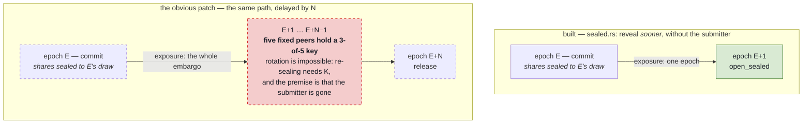
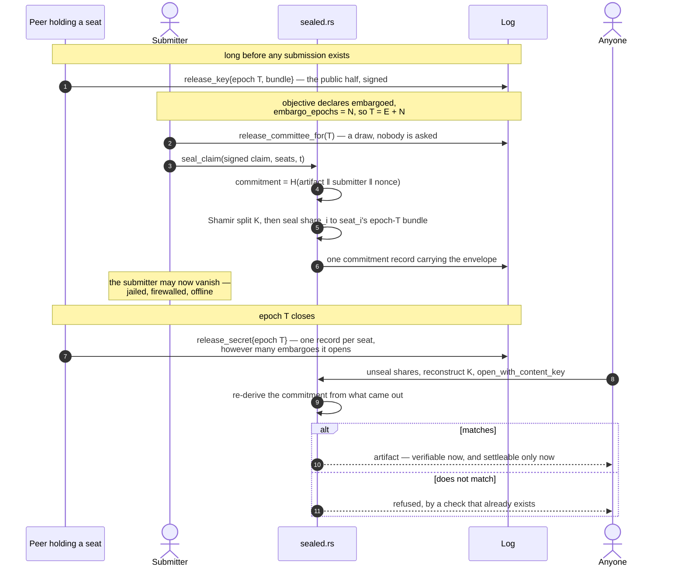
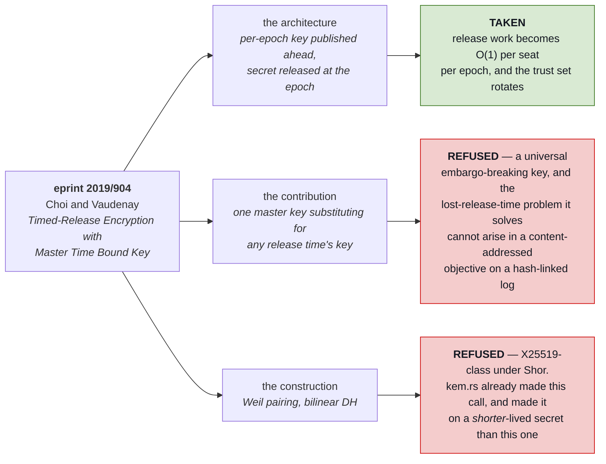

# Embargo: holding an artifact the log already owes you

**Status: design only. Nothing here is built.** The class it enforces is
([`Confidentiality::Embargoed`](../../src/records.rs)); the enforcement is the
subject.

[`threat-model.md`](../threat-model.md) carries this as **partial**, and the
sentence it uses is the right one to start from: *"an `embargoed` objective
offers a promise the code does not yet keep."*

Diagrams follow [`diagrams.md`](../diagrams.md)'s rule — **dashed is unbuilt** —
which in this note means most of what is drawn. Solid nodes are things you can
`grep` for today.

## What is already built, precisely

Three separate things exist and are easy to mistake for each other.

| built | what it does | what it does *not* do |
|---|---|---|
| `Confidentiality` on `Objective` | declares `public` / `embargoed` / `sealed`, inside the objective's content-addressed id | it is read by **nobody**. `grep confidentiality src/node.rs` returns nothing |
| `sealed.rs` + `committee_share` | opens a submission **without the submitter** at the epoch boundary | it opens as *early* as possible, which is the opposite of an embargo |
| epoch-batched settlement (`settle_due`) | drains a reveal epoch in beacon order | it has no notion of an epoch that is due but withheld |

The second row is the one that misleads. `sealed.rs` is not embargo machinery
with the delay missing. It solves [`censorship.md`](../censorship.md) §1 — a
submitter who is DoSed, jailed or firewalled between commit and reveal loses
work they have already done — and it solves it by making the reveal happen
*sooner and without them*. Embargo needs the same envelope to open *later*. The
envelope is shared; the timing rule is the opposite one.

## The gap is not "add a delay to `open_sealed`"

That is the obvious patch and it is wrong, for a reason that lives in
`committee_for`'s own doc comment:

> A fixed committee is a fixed set to bribe, and `docs/censorship.md` §2 is
> explicit that membership must be "diverse and rotated per epoch" because `t`
> colluding members can read every artifact early.

The draw is `H(beacon(epoch, anchor) ‖ peer.transport)` over the *commit*
epoch, and each share is KEM-sealed to the transport key of a member drawn
there. So the set that can reconstruct `K` is fixed at commit time and cannot
change afterwards without someone who holds `K` re-sealing — and the premise of
the whole module is that that someone may be gone.

Rotation therefore does not survive a delay. Today the window between sealing
and opening is one epoch, so a frozen committee is frozen for ten minutes. Under
a 144-epoch embargo the same five peers hold a 3-of-5 key to the artifact for a
day, and under a 90-day embargo, for 90 days. **The collusion window grows
linearly with the embargo length, which is the one parameter an embargo exists
to make large.** A delay parameter on `open_sealed` would ship that silently.



The red box is the whole objection, and note what it is not: no new risk is
introduced. It is the *existing* one-epoch exposure, stretched by exactly the
factor the feature invites a funder to make large.

## Three shapes, and what each actually costs

| | who can open | rotation | per-epoch work | new assumptions |
|---|---|---|---|---|
| **frozen committee** | the 5 peers drawn at commit | none | none | none |
| **proactive resharing** | the 5 peers drawn *this* epoch | yes | O(embargoes in flight) per member, every epoch | none |
| **release keys** | anyone, once the epoch's secrets are out | yes | O(1) per member, per epoch | none, if the KEM is the one already in use |

**Frozen committee** is a two-line change and an honest paragraph. It is the
right thing to build first only if the paragraph is written: the class means
"five named peers can read this early, for the whole embargo."

**Proactive resharing** keeps rotation by having this epoch's holders reshare
`K` to next epoch's draw without reconstructing it. It needs no new
cryptography — `crypto/shamir.rs` and `crypto/kem.rs` are sufficient — and it is
the wrong shape anyway: every member does work proportional to the number of
embargoes in flight, every epoch, forever, and a member who misses an epoch
drops out of the chain. Rivest, Shamir and Wagner rejected the equivalent design
in 1996 for the same reason, and the property they wanted instead is the third
row.

**Release keys** is the one worth building, and the rest of this note is that.

## What the release-key shape is

It is [RSW §4](https://people.csail.mit.edu/rivest/pubs/RSW96.pdf) — the offline
variant — almost unchanged:

> Each trusted agent constructs a public/private keypair for each future time
> `t`. The public key is published immediately and the private key is published
> at time `t`.

Applied here: a peer publishes, in advance, a KEM public bundle for each future
epoch it intends to serve. A submitter sealing an embargoed artifact for release
at epoch `T` Shamir-splits `K` as today and seals share `i` to seat `i`'s
**epoch-`T` bundle** rather than to its long-term transport key. At `T` each
seat publishes one record: the secret half of that epoch's bundle. Anyone then
opens every embargoed submission addressed to `T`.

Three properties fall out, and each is a thing the frozen and resharing shapes
do not have:

- **A member's release work is O(1) per epoch.** One secret, not one share per
  submission. This is RSW's stated reason for preferring agents that "do not
  have to store any information that is given to them by the user."
- **The trust set rotates by construction.** Epoch `T`'s secret is held by
  whoever published a key for `T`. Nothing about epoch `T + 1` is in their
  hands.
- **The envelope format does not change.** `SealedEnvelope::open_with_content_key`
  already exists. Recovering `K` by a different route reaches the same
  `sealed::open`, the same commitment re-derivation, and the same refusal on
  mismatch. Embargo adds a second way to recover `K`, not a second kind of
  submission.

Drawn against §6 of [`diagrams.md`](../diagrams.md), which is the same flow with
the timing rule inverted:



Step 7 carries the whole argument. In §6 the equivalent step is one record **per
submission, per seat**; here it is one record **per epoch, per seat**, and that
single change is what lets the trust set rotate while an embargo is running.

## What eprint 2019/904 offers, and what to refuse

[Choi and Vaudenay, *Timed-Release Encryption With Master Time Bound Key*](https://eprint.iacr.org/2019/904)
is the modern form of RSW §4: a server publishes a time bound key at each
release time, and their contribution is a **master** key that substitutes for
the key of any release time. Their motivation is a receiver who has lost the
release time and can no longer identify which key opens their ciphertext.

**Take the architecture. Refuse both the contribution and the construction.**



**The master key is a backdoor here, and it fixes a problem this log does not
have.** The release epoch is in the objective, which is content-addressed and
hash-linked. Nobody loses it. A key that opens every release time is a universal
embargo-breaking key — the escrow party [`threat-model.md`](../threat-model.md)
declines to reintroduce for key loss, granted here over every embargo at once.

**The Weil pairing is disqualified by a call this repository already made.**
[`crypto/kem.rs`](../../src/crypto/kem.rs) removed X25519 from committee-share
sealing and says why:

> a network whose transport is quantum-resistant and whose *submissions* are not
> has moved the weakness rather than removed it.

A pairing-friendly curve is X25519-class under Shor. Adopting one for the
release key would put the network's **longest-lived** secret on its **only**
pre-quantum primitive — and long-lived is not incidental to an embargo, it is
the entire feature. Harvest-now-decrypt-later is the exact threat model an
embargo is written against.

So the release-key bundle is the existing `Bundle`: McEliece mandatory, ML-KEM
and HQC additive, combined rather than chosen. No new hardness assumption enters
the system, and none of `kem.rs`'s reasoning has to be relitigated.

## The storage cost RSW predicted, priced

RSW named the offline variant's one weakness and it survives intact:

> it seems hard to encode any structure into the agents' keys so it seems to
> require more storage to store the list of public keys for the future.

They priced it at ~2 MB for fifty years of daily keys. Here, `EPOCH_SECONDS` is
600, so a day is 144 epochs, and a McEliece public key is 261,120 bytes:

| horizon | keys | McEliece only | ML-KEM only |
|---|---|---|---|
| 1 day | 144 | 37 MB | 170 KB |
| 30 days | 4,320 | 1.1 GB | 5.1 MB |

Per member, published on the log, for one embargo horizon. That is not
affordable, and it is the real engineering problem in this design — not the
cryptography.

Three ways out, in order of preference:

1. **Coarse release epochs.** An embargo does not need ten-minute resolution.
   A release grid of one key per day cuts the count by 144 and costs an embargo
   at most a day of imprecision. This alone makes the McEliece column ~260 KB
   per member per year.
2. **Publish lazily.** A key for `T` need exist only before the first submission
   addressed to `T`. Members publish a rolling window and extend it on demand.
3. **RSW's hash chain for the past, never the future.** `s_t = f(s_{t+1})`
   means the latest published secret derives every earlier one, so a node that
   has been offline needs one value to open every embargo that has already
   lifted — the catch-up property, which composes directly with the gossip
   CRDT's partial-connectivity design. It is the half of "master key" that is
   safe: it opens the past and reveals nothing about the future. It does not
   shrink the list of future *public* keys, which is the half that is expensive.

Choi and Vaudenay's master key would collapse that table to one row. That is
genuinely why the paper is attractive, and it buys it by making one key open
everything. The trade is not available at a price this project can pay.

## The interface

Two records, mirroring `committee_share`'s shape and signing discipline.

```rust
/// One peer's KEM public bundle for a future release epoch.
///
/// Published in advance; the secret half follows at `epoch`. Signed by the
/// peer's `identity` for the same reason `PeerRecord` is: a record whose whole
/// purpose is to authenticate a key authenticates nothing unsigned.
pub struct ReleaseKey {
    pub epoch: u64,
    pub identity: String,
    pub bundle: Bundle,
    pub created_at: String,
    pub signature: Option<String>,
}

/// The secret half, published once `epoch` has closed.
pub struct ReleaseSecret {
    pub epoch: u64,
    pub identity: String,
    pub secrets: SecretBundle,
    pub created_at: String,
    pub signature: Option<String>,
}
```

```rust
impl Node {
    /// Who holds release keys for `epoch`, in draw order.
    ///
    /// Same draw as `committee_for`, over the peers that published a
    /// `ReleaseKey` for `epoch` rather than over every peer. Still a pure
    /// function of the log: the submitter computes it to seal, a member
    /// computes it to learn its seat, a reader recomputes it to decide whether
    /// a published secret came from a seat that exists.
    pub fn release_committee_for(&self, epoch: u64, positions: usize)
        -> Result<Vec<CommitteeSeat>, RuleViolation>;

    pub fn post_release_key(&mut self, key: &ReleaseKey, ts: &str)
        -> Result<String, RuleViolation>;

    /// Refused before `epoch` has closed — the rule the whole feature is.
    /// Derived from the record's own `created_at`, never from a clock.
    pub fn post_release_secret(&mut self, secret: &ReleaseSecret, ts: &str)
        -> Result<String, RuleViolation>;

    /// Embargoed submissions whose release epoch has arrived, with how many
    /// secrets are published against the threshold they need.
    pub fn pending_embargo_releases(&self, now_epoch: u64) -> Vec<PendingRelease>;

    /// Open one, and settle it. Anyone may call this; the caller is trusted
    /// with nothing, because `sealed::open` re-derives the commitment.
    pub fn release_embargoed(&mut self, commitment_id: &str, ts: &str)
        -> Result<Outcome, RuleViolation>;
}
```

**`beacon` is deliberately not the word.** `partition::beacon` and the `beacon`
record are the settlement randomness, drawn *in* the epoch they order and public
the moment they exist ([`chain-beacon.md`](chain-beacon.md)). A release key is
its inverse: generated long before its epoch and secret until it. Two per-epoch
published values with opposite secrecy rules should not share a noun.

### The one field that changes an id

The embargo length belongs on the **objective**, not the commitment:

```rust
pub struct Objective {
    // ...
    pub confidentiality: Confidentiality,
    /// Epochs after the commit epoch before an artifact is released.
    /// Omitted from the canonical form when `None`, exactly like `deadline`.
    pub embargo_epochs: Option<u64>,
}
```

For the reason `Confidentiality` is already there: it is the funder's
disclosure decision, and being inside the id is what stops it changing
mid-bounty. A length the poster could shorten after work started is the same
attack as a class they could downgrade.

`validate` gains a pair: `Embargoed` requires the field, and every other class
refuses it. An embargo of zero epochs is `public` under another name, and an
embargo on a `public` objective is a field that means nothing — both are
refused rather than ignored, following `UnknownConfidentiality`.

Only objectives that set it move. `public` objectives serialise unchanged, so
`conformance/vectors.json` should reproduce untouched; per
[`anchored-time.md`](anchored-time.md) that is to be *confirmed* before anything
is written, not assumed.

## Embargo defers payment, and that has not been said out loud

[`censorship.md`](../censorship.md) says priority "is timestamped immediately by
the commitment," which is true and incomplete. Settlement needs a verdict,
a verdict needs the pinned verifier to run on the artifact, and nobody can read
the artifact until release. So an embargoed claim settles at release, not at
commit.

That is not a defect, but it is the honest description of the class: **an
embargo delays the money along with the disclosure.** What it buys over simply
submitting later is that the commitment fixes priority now, and the artifact
cannot be withheld — not by a censor, and not by the submitter. Paying earlier
than disclosure would require settling on an artifact nobody has verified, which
is `sealed`, which needs zero-knowledge verification and is refused.

Two consequences to resolve before building:

- **The duplicate race.** `settle_due` consumes an artifact id per batch, so a
  public duplicate submitted during the embargo settles first and the embargoed
  original — which committed earlier — is the duplicate. Either the consumed-set
  check spans batches by commit epoch, or the class quietly costs you priority
  in exactly the case the commitment was supposed to protect.

  ```mermaid
  flowchart LR
      a["<b>epoch E</b><br/>Alice commits<br/><i>embargoed, N epochs</i>"]
      b["<b>epoch E+5</b><br/>Bob commits<br/><i>public, same artifact</i>"]
      s1["<b>epoch E+6</b><br/>settle_due drains E+5<br/>Bob is paid"]
      s2["<b>epoch E+N</b><br/>Alice's artifact released<br/>refused as a duplicate"]

      a --> s2
      b --> s1
      s1 -.->|"artifact id already consumed"| s2

      style s1 fill:#fff2cc,stroke:#bf9000,color:#141821
      style s2 fill:#f4cccc,stroke:#cc0000,stroke-dasharray: 5 5,color:#141821
  ```

  Nothing here is a bug in `settle_due` — it is the duplicate rule working
  exactly as written, on a timeline it was never shown. The commitment that came
  first loses, and it loses *because* its funder asked for coordinated
  disclosure.
- **Which epoch's beacon orders it.** A claim released in epoch `T` from a
  commitment in epoch `E` has two candidate sort keys. `E` is the one that
  matches "the anchor is fixed before anyone reveals"; `T` is the one
  `settle_due` currently reaches for.

## What this does not fix

- **`t` colluding members still read early.** Rotation shrinks the window to one
  epoch and does not remove it. Nothing short of zero-knowledge does.
- **A member who never publishes.** Below threshold, the artifact is
  unrecoverable and the class has silently become `sealed` — the one class the
  repository refuses rather than downgrades to. `COMMITTEE_SIZE - THRESHOLD` is
  2 today; over a long embargo the odds of losing three of five peers are not
  the odds of losing three of five over ten minutes. Availability of the release
  committee is a real liveness question and it does not have an answer here.
- **Whether the result should have been embargoed.** A class is a declaration.
  It says nothing about whether the disclosure decision was the right one, and
  the coordinated-disclosure *process* [`threat-model.md`](../threat-model.md)
  asks for is a human process this mechanism serves, not one it replaces.

## Next

1. Confirm the vectors do not move under an omitted-when-`None`
   `embargo_epochs`. It is the difference between a contained change and a
   protocol break, and it is cheap to check first.
2. Decide the release grid. Everything in the storage table follows from it, and
   it is a network constant, so it cannot be changed later without stranding
   published keys.
3. Resolve the two settlement-ordering questions above. They are rules about
   money and belong in both implementations before either has code.
4. Only then the records, the draw, and the release path — in `src/` and
   `reference/rust/` together, per [`AGENTS.md`](../../AGENTS.md).
