# Diagrams

Architecture and detailed design, drawn from the code rather than from intent.
Every edge here corresponds to a real `use` or a real call; where the diagram
shows something unbuilt it is drawn dashed and labelled.

- [1. System context](#1-system-context) — who touches it and what crosses the boundary
- [2. Module architecture](#2-module-architecture) — the crate, and what depends on what
- [3. The settlement path](#3-the-settlement-path) — post → commit → reveal → settle
- [4. Objective lifecycle](#4-objective-lifecycle) — the state machine
- [5. The verdict taxonomy](#5-the-verdict-taxonomy) — why four statuses and only two settle
- [6. Sealed submission](#6-sealed-submission-and-threshold-reveal) — opening without the submitter
- [7. Storage layering](#7-storage-layering) — codec, quota, mirror
- [8. Money flow](#8-money-flow) — escrow, citation flow, the node fee
- [9. Trust boundaries](#9-trust-boundaries-and-sybil-surfaces) — and where sybil bites

---

## 1. System context

Four roles, one log. The property the whole design exists to deliver is the
dashed arrow at the bottom: **an auditor needs nothing but a copy of the log.**

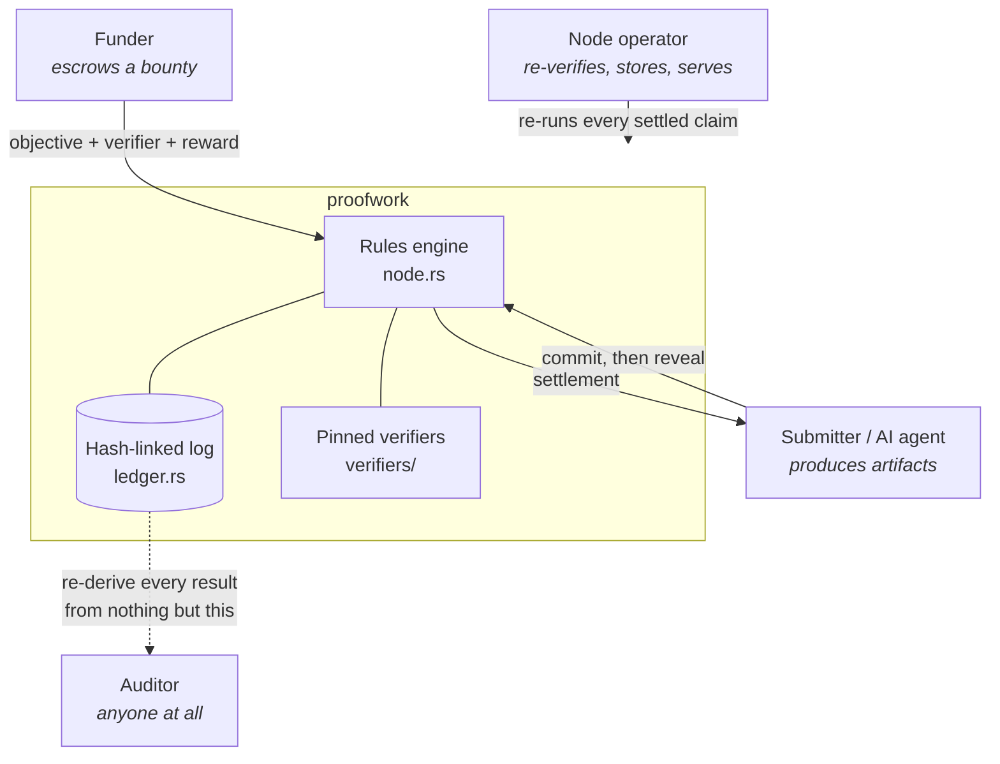

**What crosses the boundary and what does not.** An objective's verifier is
*part of its content-addressed id*, so a funder cannot change the rules of a
live bounty — doing so forks the objective and the claims against the original
stop resolving. That is not a guard; it is unrepresentable.

---

## 2. Module architecture

Solid edges are real dependencies. Note the two modules with **no inbound
arrows from the protocol core** — that is deliberate and load-bearing.

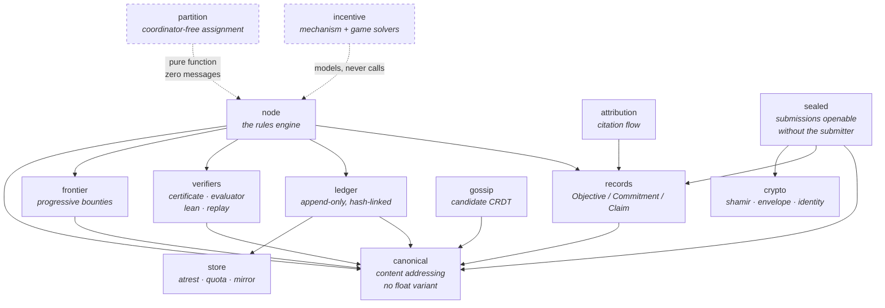

Three things this picture is making a claim about:

**`canonical` is the root and depends on nothing.** It is the cross-implementation
contract — the reference implementation has to agree with it byte for byte — so it is
kept free of every other concern. Its `Value` has no float variant, which means
an object whose identity could differ between two honest nodes *cannot be
constructed*.

**`ledger → store` is the only new inbound edge.** At-rest encryption is a
storage concern; the hash chain is an integrity one. Sealing changes no entry
hash, no `prev` link, no Merkle root and no audit result, which is why
`verify_chain` needed no changes at all.

**`incentive` calls nothing.** It is a model of the node game, not a code path —
no canary is generated, no bond posted, no challenge issued. Drawing it
connected would be a lie about what runs.

---

## 3. The settlement path

The exact order in `Node::reveal`. Order is the design here: three of these
checks are only correct where they are.

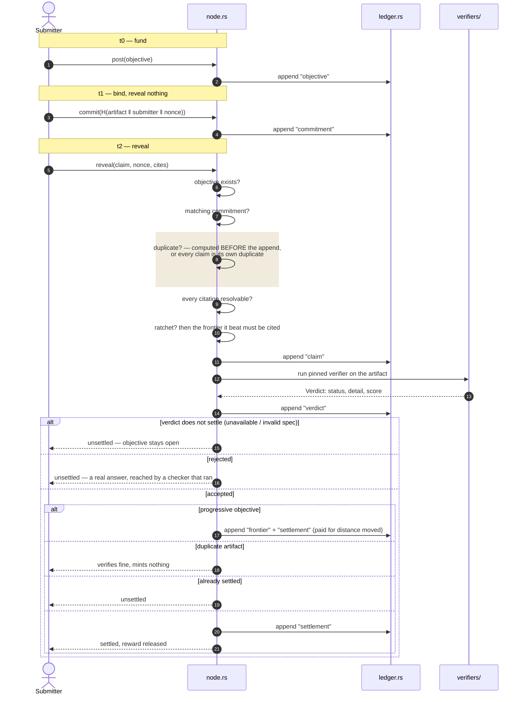

Why the shaded step is where it is: novelty is computed against the log
*before* the claim joins it. Move that line three statements later and every
claim becomes a duplicate of itself.

---

## 4. Objective lifecycle

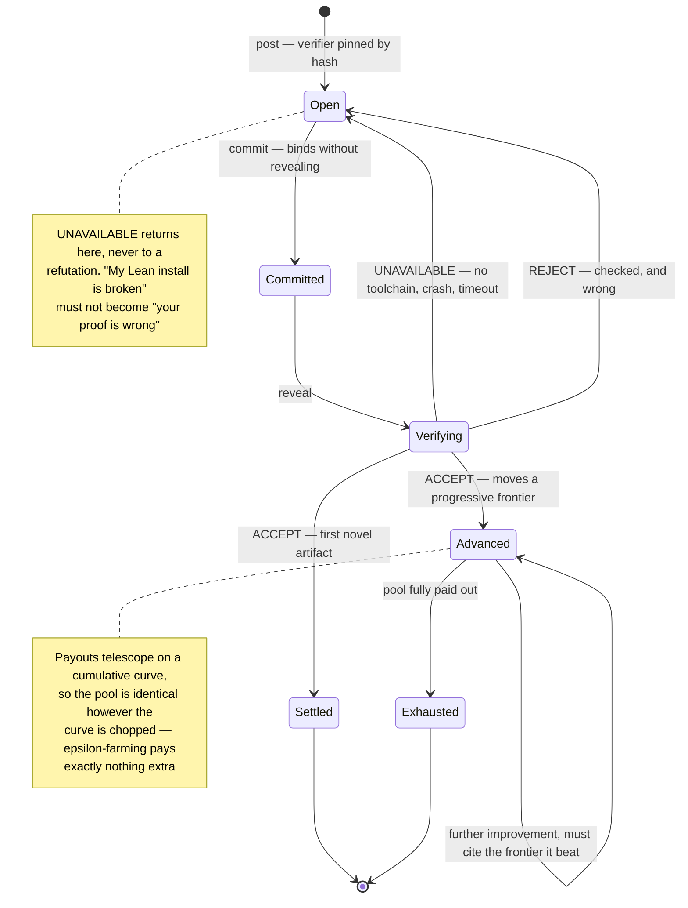

---

## 5. The verdict taxonomy

Four statuses, two of which move money. The split is the single most
consequential type decision in the crate.

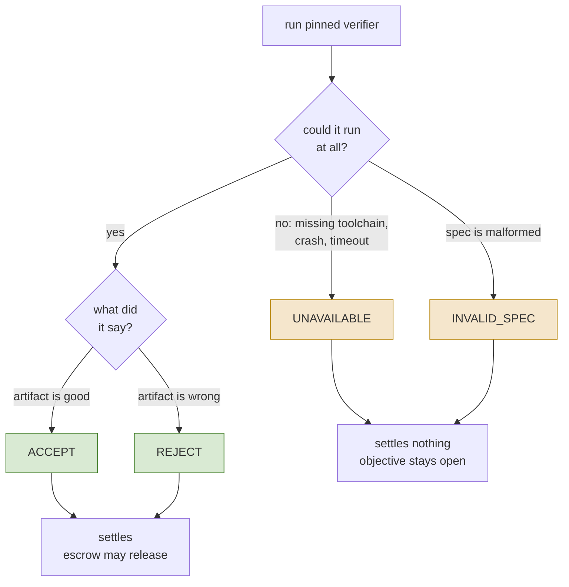

Collapsing `UNAVAILABLE` into `REJECT` would turn every infrastructure outage
into a claim about somebody's artifact — and hand an attacker a way to fail
every honest submission by taking verifiers offline.

---

## 6. Sealed submission and threshold reveal

Plain commit–reveal requires the submitter to act **twice**, and an adversary
who can neither forge nor steal your work can still take it by stopping the
second action. This is the fix.

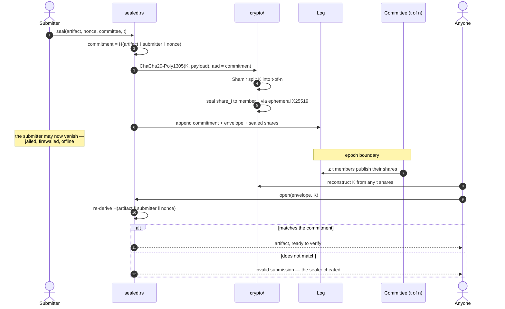

**Binding, not secrecy, is the security argument.** The commitment already
hashes the plaintext, so a submitter who seals garbage is caught the moment the
committee opens it. Sealing moves **when** an artifact becomes public. It never
moves **whether**.

The two attacks this game admits pull the threshold in opposite directions:

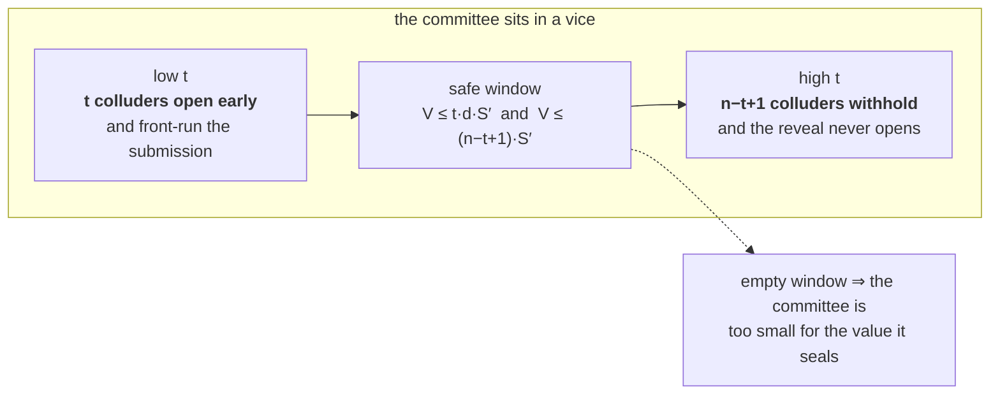

---

## 7. Storage layering

Where at-rest encryption sits, and what it deliberately does not touch.

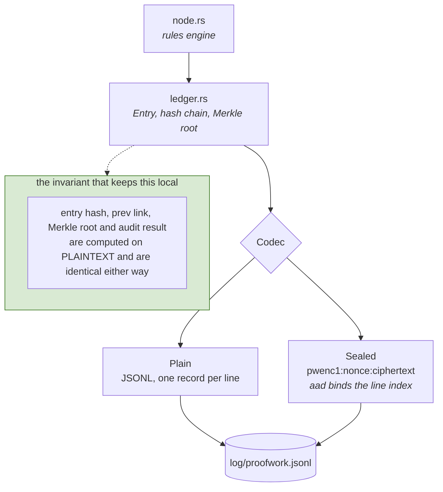

The data directory, its two storage classes, and the mirror:

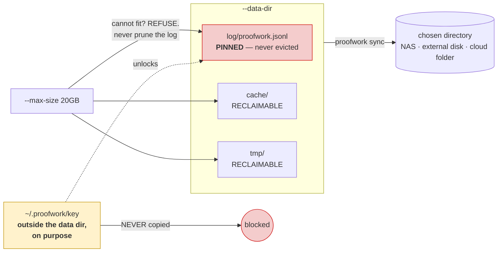

A key beside its ciphertext looks fine right up until the folder is synced
somewhere else — and then it was never encryption at all. That is why the
default key path is outside the data directory, and why `sync` detects key files
by **content rather than filename**.

---

## 8. Money flow

Everything downstream of one rule: *a claim mints only if a bounty was escrowed
against that exact statement hash before any witness for it existed.*

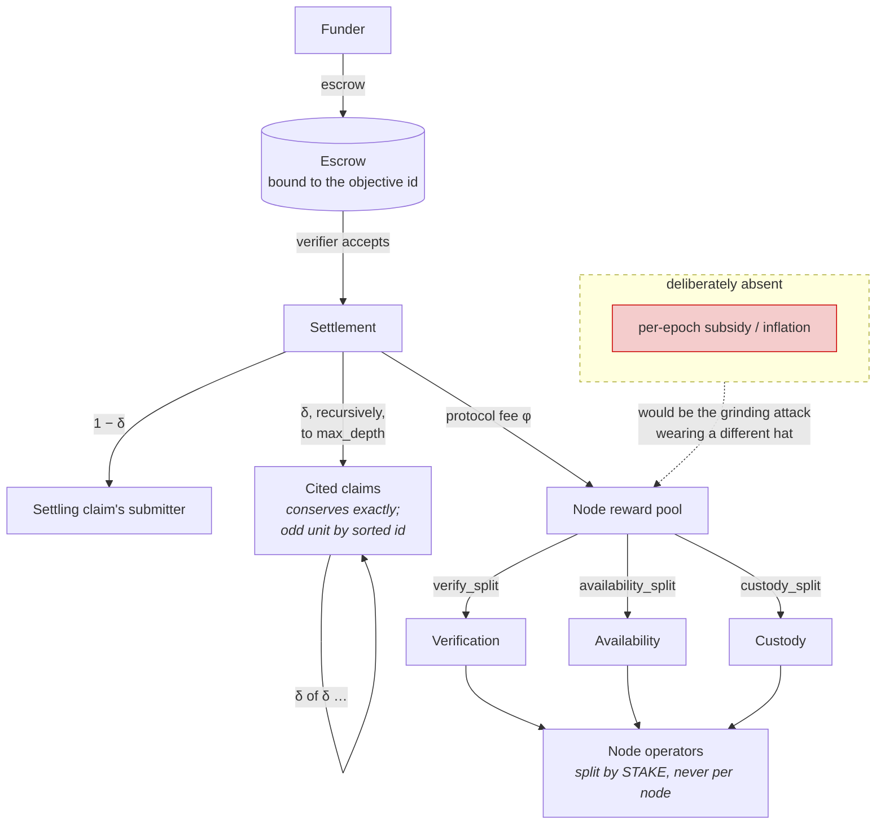

Two consequences the diagram makes visible:

- **Security spend is proportional to settled value — and is zero at launch.**
  `proofwork incentives --settled 0` prints `fee pool supports no nodes`. Stated,
  not solved.
- **The pool decides how many nodes exist; it has no effect on whether they do
  the work.** A rubber-stamper collects the same share, so the pool cancels out
  of every honest-versus-lazy comparison.

---

## 9. Trust boundaries and sybil surfaces

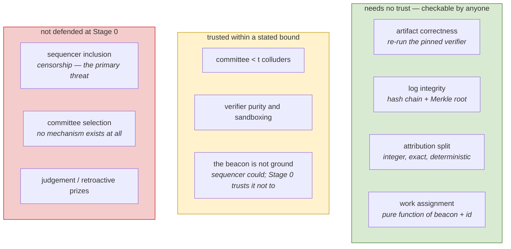

Sybil resistance, surface by surface. The rule that generates every row:
**influence must be tied to something unforgeable or conserved under splitting** —
and this system has exactly two, verified artifacts and stake.

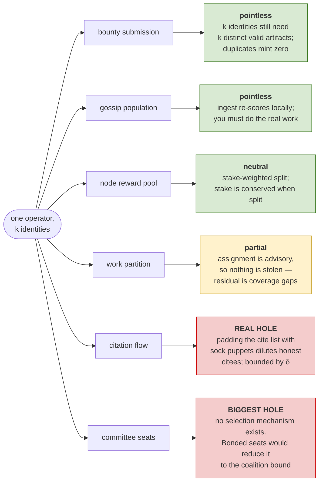

---

## What these diagrams are not

They describe Stage 0 plus the two design modules built on top of it. Three
boxes above are drawn but not implemented — committee selection, the canary
generator, and forced inclusion — and each is labelled rather than quietly
rendered as though it ships. See [roadmap.md](roadmap.md) for the order worth
doing them in and [threat-model.md](threat-model.md) for what each one leaves
open until then.
